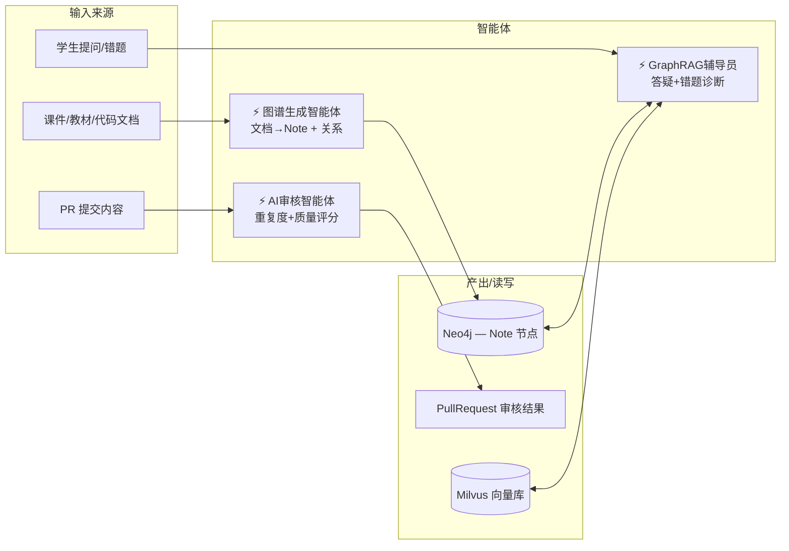

# KG-Class 实体关系图

## 设计理念

> Obsidian 风格的知识节点模型：统一使用 Markdown 文档（Note）作为图谱的基本单元，通过标签（tags）区分节点类型，而非为每种节点类型单独建模。只有 Markdown 无法承载的内容（习题、PPT/PDF 等二进制资料）才使用独立的 MySQL 实体。

## 图例说明

```
──── 实线：MySQL 外键关系（物理约束）
- - - 虚线：逻辑引用（跨库 / 非外键 / 聚合视图）
★    聚合视图（非物理表）
⚡   智能体服务（非 DB 实体）
[G]  存储在 Neo4j
```

---

## 一、MySQL 实体关系

```mermaid
erDiagram
    User ||--o{ PrivateGraph : "Fork 创建"
    User ||--o{ PullRequest : "提交"
    User ||--o{ ReviewRecord : "审核操作"
    User ||--o{ Contribution : "获得"
    User ||--o{ WrongAnswer : "产生"

    Class ||--o{ Course : "开设"
    Course ||--|| KnowledgeGraph : "拥有主图谱"
    Course ||--o{ CourseMaterial : "包含"
    Course ||--o{ Exercise : "包含"

    KnowledgeGraph ||--o{ VersionSnapshot : "版本记录"
    KnowledgeGraph ||--o{ PrivateGraph : "被 Fork"
    KnowledgeGraph ||--o{ PullRequest : "接收 PR"

    PrivateGraph ||--o{ PullRequest : "提交 PR"

    PullRequest ||--o{ ReviewRecord : "审核流转"
    PullRequest ||--o{ Contribution : "产生贡献"

    Exercise ||--o{ WrongAnswer : "被错题引用"

    CourseMaterial }o--o{ Note : "挂载到 [G]"
    Exercise }o--o{ Note : "挂载到 [G]"

    KnowledgeGraph ||--|| TeachingClass : "所属教学班 ★"
    Class ||--|| TeachingClass : "所属教学班 ★"
    Course ||--|| TeachingClass : "所属教学班 ★"
```

### 实体字段说明

#### User（用户）
| 字段 | 类型 | 说明 |
|------|------|------|
| id | UUID PK | |
| username | VARCHAR(64) UNIQUE | 学号/工号 |
| display_name | VARCHAR(128) | 显示名称 |
| role | ENUM(admin, teacher, group_leader, student) | 角色 |
| class_id | FK → Class | 所属班级 |
| password_hash | VARCHAR(256) | |
| avatar_url | VARCHAR(512) | |
| created_at | DATETIME | |

#### Class（班级）
| 字段 | 类型 | 说明 |
|------|------|------|
| id | UUID PK | |
| name | VARCHAR(128) | 如"计算机2101班" |
| grade | VARCHAR(16) | 入学年级，如"2024" |
| major | VARCHAR(128) | 专业，如"计算机科学与技术" |
| created_at | DATETIME | |

#### Course（课程）
| 字段 | 类型 | 说明 |
|------|------|------|
| id | UUID PK | |
| name | VARCHAR(256) | 如"数据结构" |
| semester | VARCHAR(64) | 如"2025-2026-1" |
| class_id | FK → Class | **当前 1:1，Schema 已预留 1:N** |
| created_at | DATETIME | |

#### KnowledgeGraph（知识图谱元信息）
| 字段 | 类型 | 说明 |
|------|------|------|
| id | UUID PK | |
| name | VARCHAR(256) | 图谱名称 |
| course_id | FK → Course UNIQUE | 一对一 |
| current_version | INT | 当前版本号 |
| root_graph_id | VARCHAR(256) | Neo4j 中的根图标识 |
| visibility | ENUM(private, grade_shared, public) | 可见范围 |
| license | VARCHAR(64) | 开源协议 |
| created_at | DATETIME | |

#### PrivateGraph（私人图谱 / Fork）
| 字段 | 类型 | 说明 |
|------|------|------|
| id | UUID PK | |
| owner_id | FK → User | 归属用户 |
| source_kg_id | FK → KnowledgeGraph | Fork 来源 |
| graph_ref | VARCHAR(256) | Neo4j 中的子图引用 |
| forked_version | INT | Fork 时的源版本号 |
| created_at | DATETIME | |

#### PullRequest（提交申请）
| 字段 | 类型 | 说明 |
|------|------|------|
| id | UUID PK | |
| submitter_id | FK → User | 提交人 |
| source_type | ENUM(private_graph, group_branch) | 来源类型 |
| source_private_graph_id | FK → PrivateGraph NULLABLE | 来自哪个私人图谱 |
| target_kg_id | FK → KnowledgeGraph | 合入目标 |
| change_type | ENUM(note_add, note_edit, note_delete, edge_add, edge_edit, edge_delete, material_add, exercise_add) | 变更类型 |
| diff_snapshot | JSON | 变更 Diff（含 md 前后对比） |
| status | ENUM(pending_ai, pending_group_leader, pending_teacher, approved, rejected, cancelled) | |
| ai_score | FLOAT NULLABLE | AI 质量评分 |
| ai_report | JSON NULLABLE | AI 审核报告 |
| merged_version | INT NULLABLE | 合入后的版本号 |
| created_at | DATETIME | |
| updated_at | DATETIME | |

#### ReviewRecord（审核记录）
| 字段 | 类型 | 说明 |
|------|------|------|
| id | UUID PK | |
| pr_id | FK → PullRequest | |
| reviewer_type | ENUM(ai, group_leader, teacher) | |
| reviewer_id | FK → User NULLABLE | AI 审核时为空 |
| action | ENUM(approve, reject, request_changes) | |
| comment | TEXT | 审核意见 |
| created_at | DATETIME | |

#### VersionSnapshot（版本快照）
| 字段 | 类型 | 说明 |
|------|------|------|
| id | UUID PK | |
| kg_id | FK → KnowledgeGraph | |
| version | INT | 版本号 |
| snapshot_ref | VARCHAR(256) | Neo4j 中的快照导出引用 |
| triggered_by_pr_id | FK → PullRequest NULLABLE | 哪次 PR 触发的 |
| created_at | DATETIME | |

#### CourseMaterial（课程资料 — only for non-Markdown files）
| 字段 | 类型 | 说明 |
|------|------|------|
| id | UUID PK | |
| course_id | FK → Course | |
| uploader_id | FK → User | 上传者 |
| title | VARCHAR(512) | |
| file_type | ENUM(ppt, pdf, doc, video, code, image, other) | 二进制/非 md 文件 |
| storage_url | VARCHAR(1024) | MinIO 存储路径 |
| status | ENUM(pending, approved, rejected) | 审核状态 |
| created_at | DATETIME | |

#### Exercise（习题 — only for structured questions）
| 字段 | 类型 | 说明 |
|------|------|------|
| id | UUID PK | |
| course_id | FK → Course | |
| creator_id | FK → User | |
| question_type | ENUM(single_choice, multiple_choice, true_false, code, short_answer, algorithm) | |
| difficulty | ENUM(easy, medium, hard) | 1-3 |
| content | JSON | 题干 + 选项 |
| answer | JSON | 正确答案 + 解析 |
| tags | JSON | OJ 题号、LeetCode 题号等 |
| status | ENUM(pending, approved, rejected) | |
| created_at | DATETIME | |

#### WrongAnswer（错题记录）
| 字段 | 类型 | 说明 |
|------|------|------|
| id | UUID PK | |
| user_id | FK → User | |
| exercise_id | FK → Exercise | |
| user_answer | JSON | 学生作答内容 |
| is_correct | BOOLEAN | 本次是否答对 |
| root_cause_note_id | VARCHAR(256) NULLABLE | AI 诊断的根源薄弱点 Note [G] |
| cause_chain | JSON NULLABLE | 补学因果链 |
| created_at | DATETIME | |

#### Contribution（贡献记录）
| 字段 | 类型 | 说明 |
|------|------|------|
| id | UUID PK | |
| user_id | FK → User | |
| pr_id | FK → PullRequest NULLABLE | 关联 PR（社区纠错可为空） |
| type | ENUM(note_add, note_edit, material, exercise, community_correction, answer_help) | |
| points | INT | 获得积分 |
| created_at | DATETIME | |

#### Badge（徽章）
| 字段 | 类型 | 说明 |
|------|------|------|
| id | UUID PK | |
| name | VARCHAR(128) | 徽章名称 |
| description | VARCHAR(512) | |
| icon_url | VARCHAR(512) | |
| trigger_rule | JSON | 触发条件配置 |

#### UserBadge（用户徽章关联表）
| 字段 | 类型 | 说明 |
|------|------|------|
| user_id | FK → User | |
| badge_id | FK → Badge | |
| awarded_at | DATETIME | |

#### MaterialNoteMapping（资料-Note 挂载关联表）
| 字段 | 类型 | 说明 |
|------|------|------|
| material_id | FK → CourseMaterial | |
| note_id | VARCHAR(256) | Note ID [G] |

#### ExerciseNoteMapping（习题-Note 挂载关联表）
| 字段 | 类型 | 说明 |
|------|------|------|
| exercise_id | FK → Exercise | |
| note_id | VARCHAR(256) | Note ID [G] |

#### ★ TeachingClass（教学班聚合视图）
> 非物理表，运行时由 Class + Course JOIN 计算得出
>
> 前端统一使用 `teaching_class_id` 作为上下文标识
>
> 实现为 API 层的 response DTO，内部解析为 `class_id + course_id`

---

## 二、Neo4j 图数据库 Schema

### 核心设计：统一 Note 节点

仅有一种节点标签 `Note`，通过 `tags` 数组区分类型。内容以 Markdown 格式存储。

```mermaid
graph TD
    subgraph "Neo4j — 唯一种节点标签"
        N[Note<br/>━━━━━━━━━━━━<br/>id / title<br/>content (Markdown)<br/>tags 数组<br/>kg_id]
    end

    subgraph "tags 取值（分类）"
        T1[#knowledge-point]
        T2[#code-implementation]
        T3[#experiment]
        T4[#algorithm-case]
        T5[#error-point]
        T6[#chapter]
        T7[#subject]
    end

    subgraph "关系层（Note ↔ Note）"
        PREREQ[PREREQUISITE<br/>前置依赖 →]
        CONTAINS[CONTAINS<br/>包含 →]
        CODE_IMPL[CODE_IMPL<br/>代码实现 →]
        CONFUSE[CONFUSE_WITH<br/>易混淆 —]
        OPTIMIZE[OPTIMIZE_FROM<br/>优化演进 →]
        HAS_ERROR[HAS_ERROR<br/>易错点关联 →]
    end

    N ---|"6 种关系<br/>连接自身"| N
```

### Note 节点属性

| 属性 | 类型 | 说明 |
|------|------|------|
| id | STRING PK | UUID |
| title | STRING | 节点标题 |
| content | STRING | **Markdown 格式正文**（节点核心内容） |
| tags | LIST[STRING] | 分类标签，例如 `["#knowledge-point", "#code-implementation"]` |
| kg_id | STRING | FK → MySQL KnowledgeGraph.id（多图谱隔离） |
| created_by | STRING | FK → MySQL User.id |
| created_at | DATETIME | |
| updated_at | DATETIME | |

### tags 取值约定

| 标签 | 语义 | 示例 Markdown 内容特征 |
|------|------|----------------------|
| `#subject` | 学科根节点 | 课程整体描述 |
| `#chapter` | 章节组织节点 | 章节名称、序号、教学目标 |
| `#knowledge-point` | 核心知识点 | 定义、原理、算法思想 |
| `#code-implementation` | 代码实现 | 含代码块、语言标注、复杂度分析 |
| `#experiment` | 实验操作 | 实验目的、步骤、环境要求 |
| `#algorithm-case` | 算法应用案例 | 应用场景、OJ/LeetCode 链接、解题思路 |
| `#error-point` | 易错点 | 常见错误、误解说明、出现频率 |

> 一个 Note 可同时携带多个标签。例如某个节点既是知识点又包含代码实现：`["#knowledge-point", "#code-implementation"]`

### 关系属性定义

所有 6 种关系在 Note ↔ Note 之间，语义不变：

| 关系类型 | 方向 | 属性 |
|----------|------|------|
| `PREREQUISITE` | `(A)-[:PREREQUISITE]->(B)` — A 依赖 B | `weight, description` |
| `CONTAINS` | `(parent)-[:CONTAINS]->(child)` | `order_index` |
| `CODE_IMPL` | `(code_note)-[:CODE_IMPL]->(knowledge_note)` | `language, description` |
| `CONFUSE_WITH` | `(A)-[:CONFUSE_WITH]-(B)` 无向 | `similarity_desc` |
| `OPTIMIZE_FROM` | `(optimized)-[:OPTIMIZE_FROM]->(original)` | `optimization_desc` |
| `HAS_ERROR` | `(knowledge_note)-[:HAS_ERROR]->(error_note)` | `error_desc` |

### 与旧模型对比

```
旧模型（6 类节点标签）              新模型（统一 Note + tags）
─────────────────────────          ──────────────────────────
KnowledgePoint                     Note { tags: ["#knowledge-point"] }
CodeImpl                           Note { tags: ["#code-implementation"] }
Experiment                         Note { tags: ["#experiment"] }
AlgorithmCase                      Note { tags: ["#algorithm-case"] }
ErrorPoint                         Note { tags: ["#error-point"] }
Chapter / Subject                  Note { tags: ["#chapter"] / ["#subject"] }

每种节点属性结构不同               所有 Note 属性结构完全相同
AI 需按类型生成不同字段             AI 只需生成/编辑 Markdown 文本
前端需 6 套节点详情组件             前端仅需 1 套 Markdown 渲染组件
```

### 示例 Note

```json
{
  "id": "note-001",
  "title": "快速排序",
  "content": "# 快速排序\n\n## 核心思想\n分治法：选取基准值，将数组分为两部分...\n\n## 时间复杂度\n- 平均：O(n log n)\n- 最坏：O(n²)\n\n## 代码实现\n```python\ndef quick_sort(arr):\n    ...\n```\n",
  "tags": ["#knowledge-point", "#code-implementation"],
  "kg_id": "kg-data-structure-001",
  "created_by": "user-teacher-zhang"
}
```

---

## 三、跨库引用关系

```
┌─────────────────────────────────────────────────────────┐
│                        MySQL                             │
│                                                          │
│  KnowledgeGraph ──(kg_id)──→  Neo4j 中所有 Note.kg_id    │
│  PrivateGraph ──(graph_ref)──→  Neo4j 子图标识           │
│  VersionSnapshot ──(snapshot_ref)──→  Neo4j 快照引用     │
│                                                          │
│  CourseMaterial ──[MaterialNoteMapping]──→ Note.id       │
│  Exercise ──[ExerciseNoteMapping]──→ Note.id             │
│  WrongAnswer ──(root_cause_note_id)──→ Note.id           │
│  PullRequest ──(diff_snapshot JSON)──→ Note/关系变更描述  │
│    diff_snapshot 中包含 md 文档前后对比（Git diff 风格）  │
└─────────────────────────────────────────────────────────┘
                              │
                              ▼
┌─────────────────────────────────────────────────────────┐
│                        Neo4j                             │
│                                                          │
│  仅有一类节点：Note                                       │
│  所有 Note.kg_id → 对应 MySQL KnowledgeGraph.id          │
│  Note.id → 被 MySQL 关联表引用                           │
└─────────────────────────────────────────────────────────┘
```

---

## 四、智能体服务（逻辑实体，非 DB）



| 智能体 | 输入 | 输出 | 读写 |
|--------|------|------|------|
| 图谱生成智能体 | 课件/教材/代码文档、课程大纲 | Note 节点（含 md 正文 + tags）+ 关系 JSON | 写入 Neo4j |
| AI审核智能体 | PR.diff_snapshot（含 md diff）、目标图谱上下文 | ai_score + ai_report JSON | 更新 PullRequest |
| GraphRAG辅导员 | 学生问题、当前图谱 Note、Milvus 向量 | 流式回答 + Note 引用 | 读 Neo4j + Milvus |

> AI 生成内容均以 Markdown 格式输出，直接写入 Note.content，大幅降低生成格式的复杂度。

---

## 五、完整实体总览

```
                    ┌──────────────┐
                    │    Class     │
                    │    (班级)     │
                    └──────┬───────┘
                           │ 1:N
                           ▼
                    ┌──────────────┐       ┌──────────────────┐
                    │   Course     │───────│ KnowledgeGraph   │
                    │   (课程)      │ 1:1  │  (知识图谱元信息)  │
                    └──────┬───────┘       └────────┬─────────┘
                           │                        │
              ┌────────────┼────────────┐           │ 1:N
              ▼            ▼            ▼           ▼
       ┌────────────┐ ┌──────────┐ ┌──────────┐ ┌─────────────────┐
       │CourseMaterial│ │ Exercise │ │   User   │ │ VersionSnapshot │
       │  (非md资料)  │ │  (习题)  │ │  (用户)   │ │   (版本快照)     │
       └──────┬─────┘ └────┬─────┘ └────┬─────┘ └─────────────────┘
              │             │            │
    挂载      │             │ 挂载       │ Fork/PR/审核/贡献
              ▼             ▼            │
       ┌─────────────────────────────────┼──────────────────────────┐
       │         Neo4j                                          ▼    │
       │                                                              │
       │   ┌──────────────────────────────────────────────────────┐  │
       │   │                    Note  (唯一种节点)                  │  │
       │   │  ┌────────────────────────────────────────────────┐  │  │
       │   │  │  id / title / content(Markdown) / tags[]        │  │  │
       │   │  │  #knowledge-point  #code-implementation        │  │  │
       │   │  │  #experiment       #algorithm-case             │  │  │
       │   │  │  #error-point      #chapter      #subject      │  │  │
       │   │  └────────────────────────────────────────────────┘  │  │
       │   └──────────────────────────────────────────────────────┘  │
       │                                                              │
       │   6 种关系：PREREQUISITE / CONTAINS / CODE_IMPL /            │
       │             CONFUSE_WITH / OPTIMIZE_FROM / HAS_ERROR        │
       └──────────────────────────────────────────────────────────────┘

       ┌────────────────────────────────────────────────────────────┐
       │                     协作闭环层                              │
       │                                                             │
       │  User ──提交──→ PullRequest ──流转──→ ReviewRecord          │
       │    │                │                    │                  │
       │    │                ▼                    ▼                  │
       │    │          PrivateGraph           审核结果               │
       │    │          (Fork 副本)            (AI/组长/教师)          │
       │    │                                                         │
       │    └──获得──→ Contribution ──关联──→ PullRequest              │
       │    └──获得──→ Badge (徽章)                                   │
       │    └──产生──→ WrongAnswer ──引用──→ Exercise                  │
       └────────────────────────────────────────────────────────────┘

       ┌────────────────────────────────────────────────────────────┐
       │                     智能体服务层（逻辑实体）                  │
       │                                                             │
       │  ⚡ 图谱生成智能体      ⚡ AI审核智能体    ⚡ GraphRAG辅导员    │
       │    输入文档→输出       审核 PR Diff      md 向量检索+答疑    │
       │    Markdown Note                                               │
       └────────────────────────────────────────────────────────────┘
```

---

## 六、关键关系速查

| 关系 | 源实体 | 目标实体 | 类型 | 说明 |
|------|--------|----------|------|------|
| 班级开设课程 | Class | Course | 1:N | 当前 1:1，预留扩展 |
| 课程拥有主图谱 | Course | KnowledgeGraph | 1:1 | |
| 用户 Fork 图谱 | User | PrivateGraph | 1:N | |
| 取自源图谱 | PrivateGraph | KnowledgeGraph | N:1 | Fork 溯源 |
| 用户提交 PR | User | PullRequest | 1:N | |
| PR 来自私人图谱 | PullRequest | PrivateGraph | N:1 | NULLABLE |
| PR 目标图谱 | PullRequest | KnowledgeGraph | N:1 | |
| PR 审核流转 | PullRequest | ReviewRecord | 1:N | 每次审核一条记录 |
| 用户审核记录 | User | ReviewRecord | 1:N | |
| 图谱版本快照 | KnowledgeGraph | VersionSnapshot | 1:N | 每次合并产生新版本 |
| PR 触发快照 | PullRequest | VersionSnapshot | 1:1 | 合入时触发 |
| 课程包含非md资料 | Course | CourseMaterial | 1:N | 仅二进制文件 |
| 课程包含习题 | Course | Exercise | 1:N | |
| 资料挂载 Note | CourseMaterial | Note | N:M | 跨库关联表 |
| 习题挂载 Note | Exercise | Note | N:M | 跨库关联表 |
| 用户产生错题 | User | WrongAnswer | 1:N | |
| 错题引用习题 | WrongAnswer | Exercise | N:1 | |
| 用户获得贡献 | User | Contribution | 1:N | |
| PR 产生贡献 | PullRequest | Contribution | 1:N | |
| 用户获得徽章 | User | Badge | N:M | 通过 UserBadge |
| Note 间前置依赖 | Note | Note | N:M | Neo4j PREREQUISITE |
| Note 间包含关系 | Note | Note | N:M | Neo4j CONTAINS |

---

## 七、V1.0 MVP 最小建表清单

| 序号 | 表名 | 必要性 | 说明 |
|------|------|--------|------|
| 1 | `users` | 必须 | |
| 2 | `classes` | 必须 | |
| 3 | `courses` | 必须 | |
| 4 | `knowledge_graphs` | 必须 | |
| 5 | `private_graphs` | 必须 | Fork 副本记录 |
| 6 | `pull_requests` | 必须 | 核心闭环 |
| 7 | `review_records` | 必须 | 审核链路 |
| 8 | `version_snapshots` | 必须 | 版本回滚+生长动画 |
| 9 | `course_materials` | 必须 | 非 md 资料 |
| 10 | `exercises` | 必须 | 习题 |
| 11 | `wrong_answers` | 必须 | 错题记录 |
| 12 | `contributions` | 必须 | 基础积分 |
| 13 | `material_note_mappings` | 必须 | 跨库挂载 |
| 14 | `exercise_note_mappings` | 必须 | 跨库挂载 |
| 15 | `badges` | V2.0 | 徽章体系 |
| 16 | `user_badges` | V2.0 | 徽章关联 |

**Neo4j 侧（V1.0 全部需要）**

| 元素 | 说明 |
|------|------|
| `Note` 节点 | 唯一节点标签，含 md content + tags |
| 6 种关系类型 | PREREQUISITE / CONTAINS / CODE_IMPL / CONFUSE_WITH / OPTIMIZE_FROM / HAS_ERROR |
